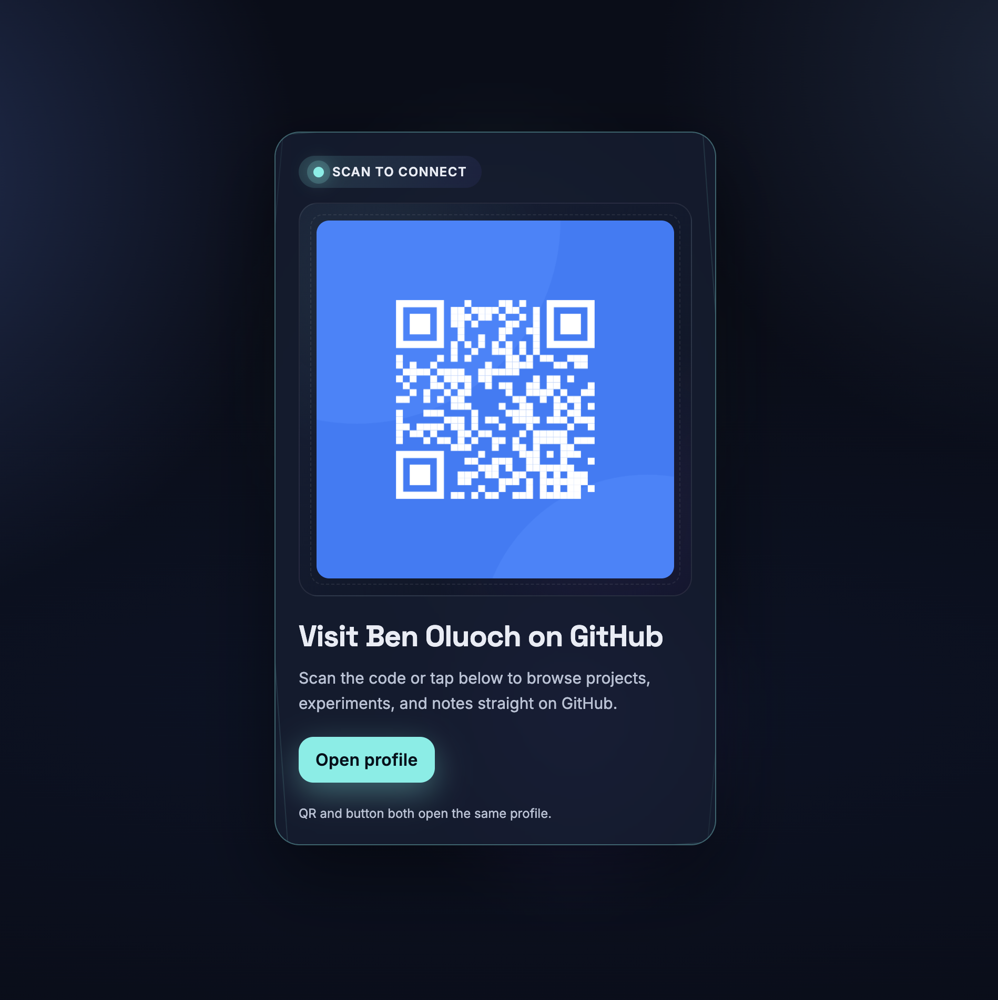

# QR Portal Card

An alternate take on the QR component challenge with a neon, glassy card and layered gradients. The QR and CTA both link to my GitHub profile.

## Table of contents
- [Overview](#overview)
  - [Screenshot](#screenshot)
  - [Links](#links)
- [My process](#my-process)
  - [Built with](#built-with)
  - [What I learned](#what-i-learned)
  - [Continued development](#continued-development)
- [Useful resources](#useful-resources)
- [Author](#author)
- [Acknowledgments](#acknowledgments)

## Overview
### Screenshot

### Links
- Live preview: _open `index.html` locally_
- Profile target: https://github.com/OluochBen
- Favicon: `./images/favicon-32x32.png`

## My process
### Built with
- Semantic HTML5
- Modern CSS (flexbox, gradients, glassmorphism)
- Google Fonts (Space Grotesk, Inter)
- Mobile-first layout

### What I learned
- Layering multiple gradients and pseudo-elements can create depth without images.
- Even single-page challenges benefit from precise accessibility labels on linked images.
- Keeping design assets out of version control is easy with a focused `.gitignore`.

### Continued development
- Add a recorded GIF or screenshot for quick previews.
- Experiment with subtle motion (hover ripples, card parallax) while keeping performance in check.

## Useful resources
- [MDN: CSS gradients](https://developer.mozilla.org/en-US/docs/Web/CSS/gradient) — quick reference for stacking multiple gradient layers.
- [WebAIM: Alternative text](https://webaim.org/techniques/alttext/) — helps keep linked images accessible.

## Author
- GitHub - [Ben Oluoch](https://github.com/OluochBen)

## Acknowledgments
- Inspired by the original Frontend Mentor QR component prompt. All styling/structure here was reimagined for a neon twist.
